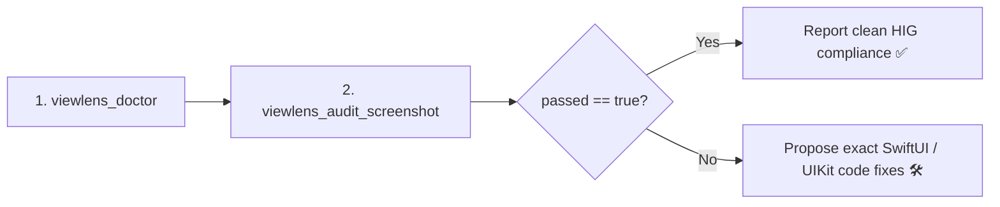

# ViewLens — Agent Skill Playbook

**ViewLens** is an Apple UI visual auditor and Human Interface Guidelines (HIG) linter. It allows you to analyze UI layouts, detect touch target violations, find overlapping views, and verify layout geometry **without passing raw image tokens to the multimodal LLM context window**.

---

## 1. Mental Model & Capabilities

ViewLens uses a fine-tuned CoreML vision model (YOLO11n from `NativeUIAuditKit`) running on the Apple Neural Engine to detect UI elements:
- `navigationBar`
- `primaryButton`
- `tabBar`
- `textField`
- `toggle`

It then runs deterministic HIG rules against detected bounding boxes to flag:
- `tappableTargetTooSmall`: Interactive elements $< 44 \times 44\text{pt}$ (e.g. 28pt height).
- `clippedElement`: Controls placed $< 3\text{pt}$ from screen/safe-area borders without margins.
- `overlappingElements`: Elements colliding with $\text{IoU} > 0.30$.
- `offScreen`: Elements positioned $> 50\%$ outside the viewport.

---

## 2. Order of Operations

When auditing UI for a developer, always follow this sequence:



### Step 1: Health & Model Readiness Probe
Call `viewlens_doctor` once per session to confirm the CoreML detector is active and loaded:
```json
// Tool Call: viewlens_doctor
{}
```

### Step 2: Audit Screenshot
Point `viewlens_audit_screenshot` at the rendered view or simulator screenshot:
```json
// Tool Call: viewlens_audit_screenshot
{
  "image_path": "DerivedData/Screenshots/LoginView.png"
}
```

### Step 3: Interpret Diagnostic Response
Examine the returned `issues` array and formulate precise code remediation.

---

## 3. Coordinate System Reference

Bounding boxes are returned in **normalized top-left `[0.0, 1.0]` coordinates**:
- `x`: Left edge normalized to image width ($0.0 \dots 1.0$)
- `y`: Top edge normalized to image height ($0.0 \dots 1.0$)
- `width`: Width normalized to image width
- `height`: Height normalized to image height

> [!NOTE]
> This matches SwiftUI `.frame(x:y:width:height:)` and UIKit coordinate conventions directly. No Y-axis inversion or conversion is required.

---

## 4. Issue Catalog & Remediation Guide

| Issue Kind | Symptom | Suggested SwiftUI Fix |
|---|---|---|
| `tappableTargetTooSmall` | Button/Toggle height $< 44\text{pt}$ | Add `.frame(minWidth: 44, minHeight: 44)` or `.contentShape(Rectangle())` |
| `clippedElement` | Content touching viewport border | Add `.padding(.horizontal)` or wrap in safe area container |
| `overlappingElements` | Views occluded or overlapping | Increase stack spacing: `VStack(spacing: 16)` or adjust `.layoutPriority()` |
| `offScreen` | View placed out of visible bounds | Use flexible constraints: `.frame(maxWidth: .infinity)` |

---

## 5. Common Pitfalls & Troubleshooting

1. **Model Not Found**: If `viewlens_doctor` reports `model_found: failed`, verify that `best.mlpackage` exists in `../NativeUIAuditKit/models/` or set the `VIEWLENS_MODEL_PATH` environment variable.
2. **Display Scale Factor**: By default, ViewLens automatically infers display scale (@2x vs @3x) from screenshot width (e.g. 1179px $\to @3x$, 750px $\to @2x$). You can explicitly override this with the `scale` argument if auditing non-standard device captures.
3. **Strict Gate**: In CI environments, ViewLens exits with code 1 if any `.error` severity issues are detected, gating pull requests before visual bugs reach production.
