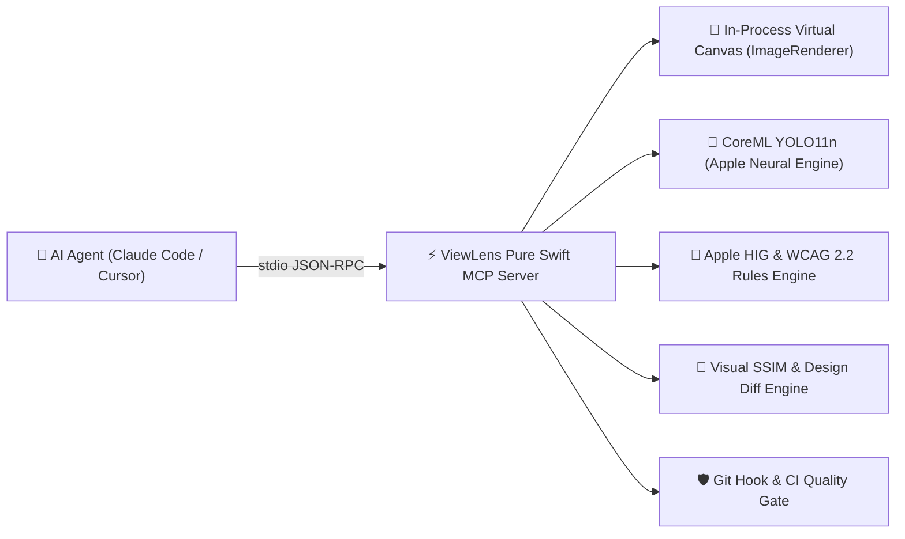

# ViewLens — Agent Skill Playbook & Tool Reference

**ViewLens** is an Apple UI visual layout auditor, Human Interface Guidelines (HIG) compliance validator, W3C WCAG 2.2 accessibility checker, and headless matrix rendering engine for native iOS and macOS applications.

It provides AI agents with deep visual layout intelligence **without bloating the agent's LLM context window with raw image tokens**.

---

## 1. Core Architecture & Mental Model



### Detection Capabilities:
- `navigationBar`
- `primaryButton`
- `tabBar`
- `textField`
- `toggle`

### Deterministic HIG, WCAG 2.2, & Design Diff Rules:
- `tappableTargetTooSmall` (**WCAG 2.5.8 AA / 2.5.5 AAA**): Applies the 24×24pt AA minimum with its spacing exception, or the enhanced 44×44pt AAA target policy.
- `contrastRisk` (**WCAG 1.4.3 AA / 1.4.11 AA**): Text/icon luminance contrast ratio $< 4.5:1$ (normal) or $< 3.0:1$ (large text/icons) in Light or Dark Mode.
- `clippedElement` / `offScreen` (**Apple HIG mobile safe-area check**): Controls placed $< 3\text{pt}$ from viewport/safe-area borders without margins.
- `dynamicTypeOverflow` / `overlappingElements` (**WCAG 1.4.10 AA / 1.4.4 AA**): Loss of content, collision, or clipping at AX1, AX3, and AX5.
- Portrait/landscape rendering (**WCAG 1.3.4 AA**): Verifies the UI is not restricted to one display orientation.
- `ambiguousAutoLayout`: Under-constrained UIKit view hierarchies.
- `missingAccessibilityLabel` / `missingAccessibilityTrait` (**WCAG 4.1.2 A**): Missing programmatic name, role, state, or required value. UIKit uses live hierarchy introspection; SwiftUI templates use registered semantic snapshots because `ImageRenderer` does not expose an accessibility tree. Screenshot-only and unregistered-template audits report this criterion as not evaluated.

---

## 2. Pure Swift MCP Tools Reference

ViewLens exposes 5 standard JSON-RPC tools over `stdio`:

### Protocol compatibility

- Legacy clients use the `2024-11-05` `initialize` handshake and retain the original tool/result shapes.
- Modern clients use the `2026-07-28` stateless protocol, call `server/discover`, and include protocol version plus client capabilities in `_meta` on every request.
- An unsupported modern version returns error `-32022` with `supported` and `requested` values so the client can retry safely.
- Modern successful results include `resultType: "complete"` and ViewLens server metadata. All five tools return typed `structuredContent` in the ViewLens evidence-envelope schema (`schemaVersion: "1.0"`) while preserving the serialized JSON `TextContent` fallback for legacy and text-oriented clients.
- The evidence envelope reports its target, environment, completeness, findings, artifacts, timing, warnings, recovery actions, and an optional stable error code. A screenshot-only audit deliberately reports programmatic semantics, Dynamic Type reflow, orientation variants, and dark-mode contrast as `notEvaluated` rather than treating unavailable evidence as a pass.
- Generated screenshot overlays and design-diff heatmaps are included as modern MCP `resource_link` content in addition to their typed artifact metadata.

### Resource discovery and bounded reads

- Call `resources/list` to discover the fixed ViewLens catalogs and retained review resources. Results are deterministically ordered, paginated in bounded pages, and marked private with a zero-second list TTL.
- Call `resources/templates/list` for `viewlens://reviews/{reviewId}`, `/findings`, `/report`, and `/artifacts/{artifactId}` URI templates.
- Read `viewlens://reviews` for the retained-review index, then prefer `/findings` when the full envelope would add unnecessary context.
- `viewlens://semantic-trees`, `viewlens://screenshots`, `viewlens://overlays`, `viewlens://baselines`, `viewlens://task-logs`, and `viewlens://reports` are category catalogs. Categories with no evidence return an explicit `not_available` state.
- Artifact reads only accept opaque catalog URIs. Binary data is snapshotted when the review is retained, capped at 10 MB, and returned base64 encoded; arbitrary filesystem URIs and path traversal are rejected.

### User-selected prompt workflows

- Modern clients can call `prompts/list` to discover five stable workflows: `viewlens_screenshot_audit`, `viewlens_design_verification`, `viewlens_release_accessibility_audit`, `viewlens_regression_triage`, and `viewlens_fix_verification`.
- Call `prompts/get` only after the user selects a workflow. Prompt arguments are bounded strings and are rendered as explicitly untrusted JSON data, not executable instructions.
- Regression-triage and fix-verification prompts return `viewlens://reviews/{reviewId}` resource links for supplied review IDs. Review identifiers allow only letters, numbers, hyphens, and underscores; filesystem-like identifiers are rejected.
- Prompt workflows preserve evaluated, not-evaluated, and unavailable evidence. They must never convert missing screenshot-only semantics, Dynamic Type, orientation, or dark-mode evidence into a pass.
- The legacy capability shape intentionally omits prompts. A client must negotiate the modern `2026-07-28` protocol before using them.

### Progress and cooperative cancellation

- Add a unique string or integer `progressToken` to request `_meta` when calling a long-running ViewLens tool. The server emits monotonic `notifications/progress` messages with a total of 100 and stops emitting after the request finishes.
- Screenshot audits report image loading, model resolution, inference, classification, and overlay export. Matrix audits report every completed permutation. Accessibility audits report semantics, target size, contrast, Dynamic Type, and orientation stages. Design verification reports rendering, SSIM, heatmap export, and nested accessibility progress.
- Cancel an active stdio request with `notifications/cancelled` and its original `requestId`. Cancellation is fire-and-forget: ViewLens stops at the next cooperative checkpoint, avoids pending artifact writes, releases the active handle, and sends no terminal response for that request.
- Unknown, completed, or malformed cancellation notifications are ignored. Duplicate active request IDs and duplicate active progress tokens are rejected.
- Progress notifications are process-bounded and ephemeral. Use durable tasks when a result must survive a reconnect or cancellation must produce a pollable terminal state.

### Durable long-running tasks

- Modern discovery advertises the `io.modelcontextprotocol/tasks` extension. A client must opt in again on every task-aware request through `io.modelcontextprotocol/clientCapabilities.extensions`; task methods without that capability return JSON-RPC `-32021`.
- Task-aware `tools/call` is available for `viewlens_audit_screenshot`, `viewlens_audit_view`, `viewlens_accessibility_audit`, and `viewlens_design_diff`. `viewlens_doctor` remains synchronous. The creation response has `resultType: "task"`, an opaque `taskId`, `status`, timestamps, `ttlMs`, and `pollIntervalMs`.
- Poll with `tasks/get`. States are `working`, `input_required`, `completed`, `failed`, and `cancelled`; terminal states are immutable. A completed task contains the original tool result, including tool-level `isError: true` results. `failed` is reserved for JSON-RPC execution or persistence failures.
- Send bounded form responses with `tasks/update` when a task exposes keyed `inputRequests`. Form-mode elicitation producers are introduced in MCP-14.16; input-response values are consumed in memory and are never persisted in the task record.
- Cancel task execution with `tasks/cancel`, not `notifications/cancelled`. Task calls report progress through the polled `statusMessage` and do not emit `notifications/progress`.
- Task records default to a one-hour TTL and 250 ms polling interval. They are stored under the user's Application Support `ViewLens/MCPTasks` directory, survive a local stdio server reconnect, and are limited to 100 records and 5 MB per record. Unknown and expired task IDs return JSON-RPC `-32602` with stable ViewLens error codes.
- Persisted task arguments must not contain credential-like keys such as passwords, secrets, authorization values, or access/refresh tokens. The directory and record modes are `0700` and `0600`; arbitrary task listing is not exposed. Treat task IDs as private local handles and do not place credentials or personal data in arguments, status text, or form responses.

### 1. `viewlens_doctor`
Probes environment, Apple Neural Engine readiness, and CoreML model status.
- **Arguments**: `{}`
- **When to use**: Call once at session start to verify detector availability.
- **Modern result**: Typed readiness data plus `unavailable_evidence` and a recovery action when required model evidence cannot be obtained.

### 2. `viewlens_design_diff`
Performs Design-to-Code verification comparing a Figma reference design image against a rendered native SwiftUI view.
- **Arguments**:
  - `reference_image` (string, required): Path to reference PNG (from Figma or design baseline).
  - `template` (string, required): Registered SwiftUI view template name.
  - `device` (string, optional): Target device profile (default `"iPhone16Pro"`).
  - `ssim_threshold` (number, optional): Minimum Structural Similarity Index (SSIM) score (default `0.98`).
  - `heatmap_path` (string, optional): Path to write annotated visual diff heatmap PNG.
  - `check_accessibility` (boolean, optional): Whether to run WCAG accessibility audits concurrently (default `true`).
- **Modern result**: Typed visual-diff, accessibility, completeness, and finding data. A successfully generated heatmap is returned as a resource link.

### 3. `viewlens_accessibility_audit`
Performs a full W3C WAI & WCAG 2.2 mobile accessibility audit on a SwiftUI template or screenshot image.
- **Arguments**:
  - `template` (string, optional): Registered SwiftUI template name (e.g. `LoginForm`, `CheckoutView`, `SocialFeedView`).
  - `image_path` (string, optional): Path to screenshot image.
  - `wcag_level` (string, optional): Target level (`"A"`, `"AA"`, or `"AAA"`; default `"AA"`). Specify exactly one of `template` and `image_path`.
- **Returns**: Structured compliance and completeness, category scores, programmatic semantics, level-aware target size, Light/Dark contrast, AX1/AX3/AX5 reflow, portrait/landscape orientation, mobile safe-area findings, and remediation snippets.
- **Modern result**: Evaluated and not-evaluated criteria are separated in the shared evidence envelope; incomplete evidence carries `unavailable_evidence` without becoming an implicit pass.

### 4. `viewlens_audit_view`
Renders a SwiftUI view template across a multi-device matrix entirely in-memory in $<0.5\text{s}$.
- **Arguments**:
  - `template` (string, required): Registered SwiftUI template name.
  - `devices` (array of strings, optional): `["iPhoneSE", "iPhone16Pro", "iPadPro11"]`.
  - `dynamic_type_sizes` (array of strings, optional): `["large", "accessibility3", "accessibility5"]`.
  - `color_schemes` (array of strings, optional): `["light", "dark"]`.
- **Response Mode**: `sourceMode: "rendered"` with synthesized worst-case issue matrix.
- **Modern result**: Typed per-permutation evidence and explicit partial completeness if any requested render cannot be produced.

### 5. `viewlens_audit_screenshot`
Audits static image files (simulator screenshots, test artifacts, mocks).
- **Arguments**:
  - `image_path` (string, required): Path to PNG/JPEG image.
  - `scale` (number, optional): Explicit display scale (@2x, @3x).
  - `min_confidence` (number, optional): Minimum detection confidence (default `0.15`).
- **Modern result**: Typed elements, findings, completeness, overlay artifacts, and stable `invalid_input`, `unavailable_evidence`, or `runtime_failure` codes for operational failures.

### 6. `viewlens_project_context_resolve`
Performs bounded, read-only discovery of the build container, transitive local source references, resources, locked packages, and preview-scenario requirements for a Swift view.
- **Arguments**:
  - `workspace_root` (string, required): Owning workspace or Swift package root.
  - `root_symbol` (string, optional): Root Swift view/type symbol to resolve.
  - `source_file` (string, optional): Root Swift source file path.
  - `project_path` (string, optional): Optional `.xcworkspace`, `.xcodeproj`, or `Package.swift` path.
  - `scenario` (string, optional): Optional named deterministic preview scenario.
  - `missing_resource_policy` (string, optional): `"fail"`, `"request"`, `"structural_mock"`, or `"generated_mock"`.
- **Modern result**: Bounded manifest report containing source closure, asset inventory, locked package pins, preview scenario requirements, synthetic mocks, and build readiness status.

---

## 3. CLI Command Suite Reference

When executing commands in the terminal, use the `viewlens` CLI binary:

| Command | Purpose | Example |
|---|---|---|
| `viewlens context` | Resolves bounded project context & closure for a Swift view | `viewlens context --workspace . --root-symbol ProfileView` |
| `viewlens nonvisual` | Screen-reader optimized nonvisual summary and outline | `viewlens nonvisual --template LoginForm --profile speech` |
| `viewlens design-diff` | Figma design-to-code visual & structural verification | `viewlens design-diff --reference figma.png --template LoginForm` |
| `viewlens accessibility` | Comprehensive W3C / WCAG 2.2 accessibility audit | `viewlens accessibility --template LoginForm --level AA` |
| `viewlens doctor` | Model readiness and system check | `viewlens doctor --json` |
| `viewlens scan <image>` | Single/multi-image screenshot audit | `viewlens scan ./screenshot.png --strict` |
| `viewlens batch <dir>` | Recursive folder screenshot audit | `viewlens batch ./DerivedData/Screenshots` |
| `viewlens render` | Headless multi-device template matrix audit | `viewlens render --template LoginForm --devices iPhoneSE,iPhone16Pro` |
| `viewlens tui` | Interactive terminal UI / headless ASCII dashboard | `viewlens tui --headless --template LoginForm` |
| `viewlens hook <gate>` | Executes Git Hook or CI Quality Gate | `viewlens hook pre-commit --fail-on error` |
| `viewlens install-hook` | Installs `.git/hooks/pre-commit` | `viewlens install-hook --type pre-commit` |
| `viewlens init-config` | Generates `.viewlens.json` configuration | `viewlens init-config` |
| `viewlens export-skill` | Exports this AI Agent Skill Playbook | `viewlens export-skill --output ViewLensSkill.md` |
| `viewlens mcp` | Starts the native Swift MCP stdio server | `viewlens mcp` |

---

## 5. Nonvisual MCP Resources & Prompt Workflows (NV-1.2 / NV-2.1 / NV-3.1 / NV-3.2)

ViewLens provides structured, token-efficient nonvisual representations via MCP resource URIs and prompt workflows:

| Resource URI | Description | MIME Type |
|---|---|---|
| `viewlens://reviews/{reviewId}/nonvisual-summary` | Concise screen summary for speech and braille | `application/json` |
| `viewlens://reviews/{reviewId}/semantic-outline` | Hierarchical nonvisual model with stable IDs | `application/json` |
| `viewlens://reviews/{reviewId}/navigation` | Reading order and focus navigation sequences | `application/json` |
| `viewlens://reviews/{reviewId}/visual-diff-narrative` | Textual narrative of spatial and visual relationships | `text/plain` |

### MCP Prompt Workflows:
- `viewlens_nonvisual_review`: Guides LLMs in conducting semantic-first code reviews evaluating reading order, visual-semantic counterparts, touch target sizes, contrast, and Dynamic Type reflow with deterministic code remediations.
- `viewlens_screenshot_audit`: Audits static screenshot for visual and WCAG risks.
- `viewlens_design_verification`: Verifies SwiftUI code against Figma design baselines.
- `viewlens_release_accessibility_audit`: Runs matrix audits across devices and font scales.
- `viewlens_regression_triage`: Triages new vs resolved findings between review runs.
- `viewlens_fix_verification`: Confirms issue resolution after code edits.

The synchronized macOS workbench **Nonvisual Outline** (`NV-2.1`) enables VoiceOver and keyboard-driven inspection of regions, elements, and findings across all review runs.

---

## 6. Agentic Workflow: Autonomous Figma-to-Code Implementation

When asked to build or match a Figma design in SwiftUI:

1. **Fetch Design Reference**: Obtain reference frame PNG via Figma MCP or local asset.
2. **Generate SwiftUI**: Write initial SwiftUI view and register in `TemplateRegistry`.
3. **Run Design Diff & Accessibility Audit**:
   ```bash
   viewlens design-diff --reference ./figma_card.png --template MyCardView --heatmap ./diff.png
   ```
4. **Analyze Deliberate Feedback**:
   - If **SSIM $< 0.98$**: Check `./diff.png` heatmap to identify misaligned padding or wrong corner radius.
   - If **WCAG 2.5.5 Fails**: Add `.frame(minWidth: 44, minHeight: 44)` to interactive touch targets.
   - If **WCAG 1.4.3 Fails**: Update text to adaptive semantic `Color.primary` for dark mode contrast.
5. **Re-Verify Quality Gate**: Ensure exit code is `0` before finalizing the code for the user.
