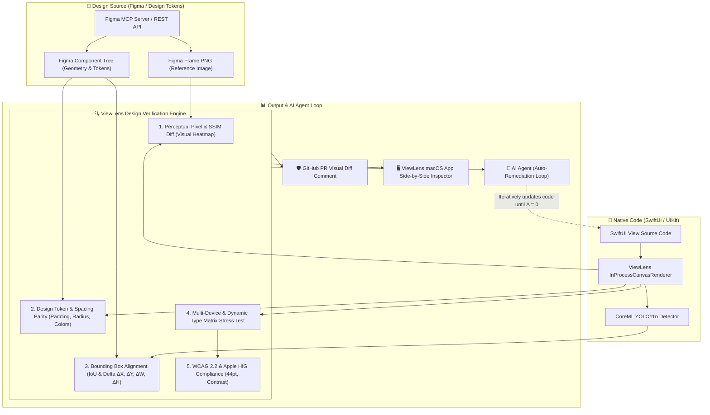

# ADR-008: Figma Design Verification, Figma MCP Integration, and Multi-Tool Design-to-Code Alignment

- **Status:** Accepted
- **Date:** 2026-08-23
- **Deciders:** Joseph McCraw, ViewLens Architecture Team
- **Tags:** `figma`, `mcp`, `design-to-code`, `visual-diff`, `accessibility`, `swiftui`, `quality-gate`

---

## 1. Context and Problem Statement

In modern native software engineering, the gap between **UI/UX design** (in Figma, Penpot, or Sketch) and **native implementation** (in SwiftUI or UIKit) represents a major bottleneck and source of quality degradation:

1. **Manual "Stare-and-Compare" Design QA:** Designers and engineers manually inspect screenshots to identify spacing discrepancies, wrong corner radii, incorrect font weights, or missed padding.
2. **Static Designs vs. Dynamic Real-World Runtime:** Figma designs typically represent a single golden state (e.g., iPhone 16 Pro, standard font size, Light appearance). They do not test dynamic real-world iOS constraints: Dynamic Type text enlargement (AX1–AX5), Dark Mode color shifts, touch target minimums (HIG 44×44pt), or small hardware viewports (iPhone SE 375pt).
3. **LLM Code Generation Hallucinations:** AI coding agents (Claude, Cursor, Windsurf) can generate SwiftUI from Figma images or Figma Dev Mode MCP nodes, but they have **no feedback loop to verify if their generated code actually matches the visual design or passes HIG/WCAG rules**.

### Core Question
How can **ViewLens** integrate with Figma (via the Figma REST API and Figma MCP server) and related design/developer tools to provide automated **Design-to-Code verification**, **visual delta auditing**, and **closed-loop AI agent pairing**?

---

## 2. Decision and Architecture

ViewLens will introduce a **Design Verification Pipeline** that pairs Figma's design source of truth with ViewLens's in-process native rendering, CoreML computer vision, and WCAG accessibility engine.



---

## 3. Detailed Verification Strategies

### Strategy A: Semantic Token & Layout Tree Parity (Token-Level)
- **Figma Extraction:** Via Figma MCP (`get_node`, `get_variable_definitions`), ViewLens extracts:
  - Component dimensions $(W, H)$
  - AutoLayout properties: `paddingLeft`, `paddingTop`, `itemSpacing`, `layoutMode`
  - Typography: `fontSize`, `fontWeight`, `lineHeightPx`, `fontFamily`
  - Color fills & variables: RGBA / Hex tokens (e.g. `Colors/Brand/Primary = #007AFF`)
  - Corner radii: `cornerRadius`, `cornerSmoothing`
- **SwiftUI Verification:** Compares against live AST inspection and ViewLens design token definitions to flag token drift:
  ```json
  {
    "token": "Spacing/CardPadding",
    "expectedFigma": 16.0,
    "actualSwiftUI": 12.0,
    "delta": -4.0,
    "remediation": ".padding(.horizontal, 16)"
  }
  ```

### Strategy B: Perceptual Pixel & SSIM Visual Diff (Image-Level)
- **Figma Reference Image:** Fetched via Figma REST API (`GET /v1/images/:key?ids=:nodeId&scale=3&format=png`).
- **Rendered Native Image:** Produced in-process via `InProcessCanvasRenderer.render(profile: .iPhone16Pro, content: view)`.
- **Comparison Metrics:**
  1. **SSIM (Structural Similarity Index):** Tolerates sub-pixel font anti-aliasing variations while catching structural layout shifts ($\text{SSIM} \ge 0.98$ required).
  2. **Pixel Diff Heatmap:** Generates an annotated delta image highlighting misaligned elements in red/magenta overlays.

### Strategy C: Bounding Box & Element Alignment Diff
- Compares Figma node bounding boxes with CoreML YOLO11n detected native UI elements.
- Reports coordinate deltas:
  $$\Delta X = X_{\text{Swift}} - X_{\text{Figma}}, \quad \Delta Y = Y_{\text{Swift}} - Y_{\text{Figma}}, \quad \text{IoU} \ge 0.95$$

### Strategy D: Design Stress-Testing (Beyond Figma's Static Mock)
While Figma only provides a single static frame, ViewLens instantly tests the generated code across:
1. **Dynamic Type Matrix:** `Large (100%)` $\to$ `AX3 (235%)` $\to$ `AX5 (312%)` to verify text doesn't truncate or break outside card boundaries.
2. **Appearance Matrix:** Light Mode vs. Dark Mode (checking WCAG 1.4.3 contrast ratio $\ge 4.5:1$).
3. **Hardware Shape Matrix:** iPhone SE ($375\text{pt}$ width), iPhone 16 Pro ($402\text{pt}$ width), iPad Pro ($834\text{pt}$ width).

---

## 4. Complementary Tools Ecosystem

ViewLens can integrate with and leverage the broader design-to-code ecosystem:

| Ecosystem Area | Tool | Integration Pattern with ViewLens |
|---|---|---|
| **Design Platforms** | **Figma** (via Figma MCP & REST API) | Source-of-truth reference frames, auto-layout trees, and design variables. |
| | **Penpot** (Open-Source Vector UI) | Webhook/API integration for open-source vector UI designs and design token sync. |
| | **Apple Design Resources (SF Symbols 6)** | HIG icon verification and standard Apple system typography metrics. |
| **Design Tokens** | **Tokens Studio (Figma plugin)** | JSON design token sync (`tokens.json` $\to$ Swift design system extensions). |
| | **Style Dictionary (Amazon)** | Automatic transformation of design tokens into native SwiftUI `Color` & `Font` assets. |
| **Developer & CI Tools** | **Fastlane Snapshot / Xcode XCTest** | Ingesting real-device UI test screenshots into `viewlens batch` for visual regression. |
| | **GitHub Actions / PR Bot** | Automated side-by-side visual diff slider (Figma Mock vs. Rendered Swift) in PR comments. |
| | **Storybook / Playwright (Cross-Platform)** | Auditing Web vs. Native UI parity for multi-platform design systems. |
| **AI Agents & LLMs** | **Claude Code / Cursor / Antigravity** | Closed-loop iterative UI refinement (`Figma Prompt -> Code -> ViewLens Audit -> Fix`). |

---

## 5. The Autonomous "Design-to-Code" Agent Workflow

```
1. User: "Build this Figma component in SwiftUI: figma.com/file/xyz?node-id=123:456"
2. AI Agent:
   a. Calls `figma_get_node` (via Figma MCP) to fetch layout metadata and reference PNG.
   b. Generates initial SwiftUI implementation `MyCardView.swift`.
   c. Calls `viewlens_design_diff(template: "MyCardView", figma_node_id: "123:456")`.
   d. ViewLens returns:
      - SSIM: 0.92 (FAIL - minimum 0.98)
      - Issue 1: Missing bottom padding (expected 20pt, actual 12pt).
      - Issue 2: Button touch target is 36pt (WCAG 2.5.5 FAIL).
      - Issue 3: In Dark Mode, text contrast is 2.8:1 (WCAG 1.4.3 FAIL).
   e. Agent updates `MyCardView.swift` to apply `.padding(.bottom, 20)`, `.frame(minHeight: 44)`, and `.foregroundStyle(Color.primary)`.
   f. Agent re-runs `viewlens_design_diff` -> SSIM: 0.995, HIG: 100%, WCAG: 100%.
3. Result: Pixel-perfect, accessible, and responsive SwiftUI code produced autonomously on the first attempt!
```

---

## 6. Consequences & Implementation Roadmap

### Positive Consequences
- **Eliminates Design QA Churn:** Engineers and designers no longer need manual inspection meetings for basic alignment or token mistakes.
- **Enables True Zero-Shot AI UI Generation:** Gives AI agents an objective, automated visual verification ground truth.
- **Prevents Design Drift in Production:** CI quality gates automatically block PRs when SwiftUI code deviates from Figma source of truth.

### Negative / Considerations
- **Figma API Rate Limits:** Figma REST API requires an API access token and has rate limits; cached reference assets and MCP stdio connection mitigate this.
- **Font Rendering Differences:** CoreText on Apple platforms renders San Francisco typography slightly differently than Chromium/Canvas in Figma; SSIM threshold must use structural filtering to avoid false positives on font anti-aliasing.

### MCP Resource Security Boundary

- ViewLens uses the custom `viewlens://` URI scheme for server-mediated evidence. It does not accept arbitrary `file://` reads through MCP.
- Modern tool results are retained in a process-bounded catalog of at most 50 reviews. Eviction removes the oldest review and its reachable resource handles.
- Generated binary artifacts are snapshotted when a review is cataloged, limited to 10 MB, and served from the immutable snapshot. Later path replacement, symlink changes, or deletion cannot redirect the read to unrelated filesystem content.
- Unknown or malformed resource URIs return JSON-RPC `-32602`; unavailable or oversized cataloged artifacts return `-32603` with stable machine-readable recovery codes.
- Resource lists and reads are marked `cacheScope: "private"`; list results use `ttlMs: 0` because retained review availability can change. Static URI templates may be publicly cached.
- Subscription support is not advertised until bounded lifecycle, cancellation, and notification delivery are implemented.

### MCP Prompt Security Boundary

- Prompts are user-controlled workflow templates and are advertised only in modern discovery. The legacy initialization contract remains unchanged.
- Prompt arguments must be string values, are limited to 4,096 characters each, reject unexpected keys and disallowed control characters, and are JSON encoded under an explicit untrusted-data boundary before interpolation.
- Review resource arguments use a restricted opaque identifier alphabet and resolve only to `viewlens://reviews/{reviewId}` links. They cannot introduce paths, traversal components, or arbitrary URI schemes.
- The prompt catalog is static, deterministically ordered, and publicly cacheable for one hour. `listChanged` remains false until bounded subscription delivery exists.
- Generated workflows instruct agents to preserve incomplete and not-evaluated evidence, and never authorize reads outside the ViewLens tools and catalog resources named by the workflow.

### MCP Execution-Control Boundary

- The stdio server dispatches requests concurrently so cancellation notifications can be processed while an audit is active, while a single actor serializes all responses and progress notifications onto stdout.
- Active request IDs and client-provided progress tokens must be unique. Progress tokens accept only strings or integers, and monotonicity is enforced server-side before a notification is emitted.
- Audits check cancellation between expensive stages and before overlay or heatmap writes. Inference and pixel comparison are cooperative rather than forcibly interrupted mid-call; cancellation takes effect at the next safe checkpoint.
- A cancelled non-subscription request produces no terminal response, matching MCP cancellation semantics. Unknown, completed, and malformed cancellation notifications are ignored.
- Execution state exists only for the lifetime of the request. At most 512 progress notifications are retained in the bounded diagnostic buffer; durable execution, polling, and reconnect recovery require the separate MCP task-handle milestone.

### Milestones for ViewLens
- **Milestone 8A:** Figma Token Parser (`FigmaTokenSync.swift`) — import Figma variables and typography into Swift.
- **Milestone 8B:** Image SSIM & Perceptual Diff Engine (`VisualDiffEngine.swift`).
- **Milestone 8C:** `viewlens design-diff` CLI command & `viewlens_design_diff` MCP tool.
- **Milestone 8D:** Figma MCP Bridge integration in `viewlens doctor` and `ViewLensSkill.md`.
