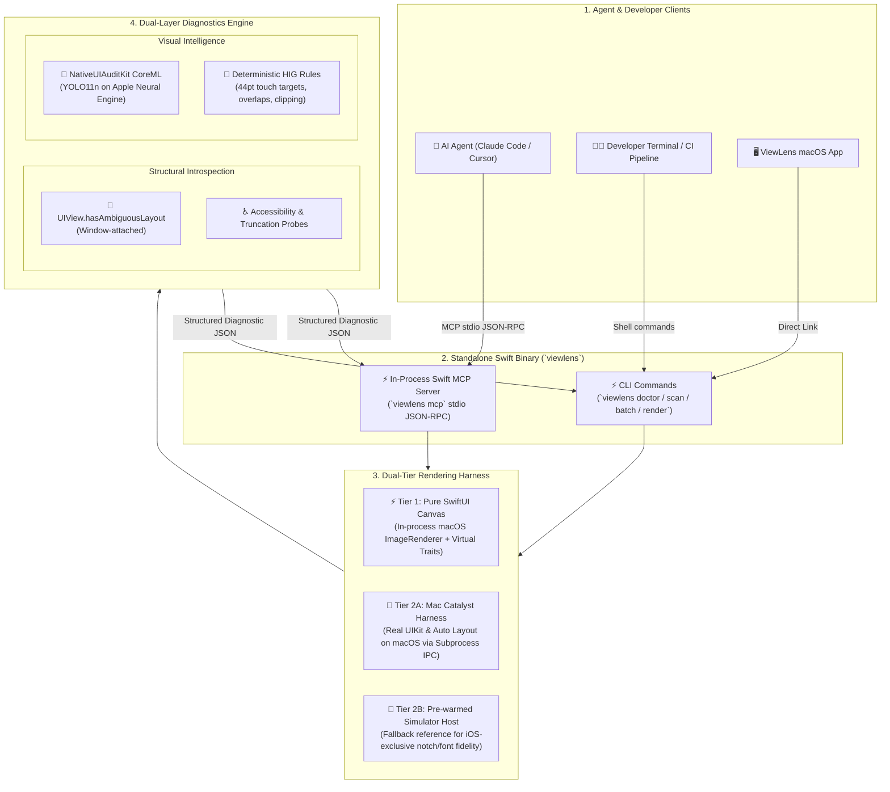

# ViewLens 🔍

> **100% Pure Swift AI Agent MCP Server, Dual-Tier Visual Canvas & UI Audit CLI for Native Apple Platforms**

[](https://developer.apple.com/macos/)
[](https://swift.org)
[](https://developer.apple.com/documentation/coreml)
[](https://github.com/SerialForBreakfast/NativeUIAuditKit)
[](https://modelcontextprotocol.io)
[](https://swift.org)
[](LICENSE)

---

## Overview

**ViewLens** is a single, standalone native macOS CLI and Model Context Protocol (MCP) server that connects AI coding agents (Claude Code, Cursor, Windsurf, Xcode AI) to native Apple UI layouts.

**100% Pure Swift**: ViewLens contains **zero Python or pip dependencies**. The MCP server runs directly inside the native `viewlens` binary (`viewlens mcp`) using in-process Swift JSON-RPC 2.0.

By combining an ultra-fast **dual-tier headless canvas renderer** with the fine-tuned CoreML vision models trained in [NativeUIAuditKit](https://github.com/SerialForBreakfast/NativeUIAuditKit), ViewLens detects UI elements, evaluates Apple Human Interface Guidelines (HIG), and performs programmatic Auto Layout introspection **without burning multimodal LLM tokens on raw image uploads or waiting for multiple iOS simulator boots**.

### Why ViewLens?

- ⚡ **Zero Python / 100% Pure Swift**: Single native macOS binary. No `pip`, no Python runtime, no virtual environments.
- 🧠 **Token-Free UI Audits**: LLMs receive structured JSON coordinate geometry (`x`, `y`, `width`, `height` in normalized top-left space) and semantic issue classifications rather than raw image pixels.
- 🏎️ **Dual-Tier Headless Canvas (Zero Simulator Boot Matrix)**:
  - **SwiftUI Views**: Rendered in-process on macOS via `ImageRenderer` in $<5\text{ms}$ with injected device dimensions, Dynamic Type sizes, and color schemes.
  - **UIKit Views & ViewControllers**: Rendered via a **Mac Catalyst harness** running the real Apple UIKit and Auto Layout engine directly on macOS.
- 🔍 **Root-Cause + Visual Symptom Diagnostics**:
  - **Structural Introspection**: Programmatically detects ambiguous layout via `UIView.hasAmbiguousLayout` and constraint conflicts.
  - **Visual Intelligence**: YOLO11n CoreML vision model catches sub-44pt touch targets, boundary clipping, text truncation, and cross-element overlaps.
- 📐 **Direct SwiftUI / UIKit Alignment**: Bounding boxes match SwiftUI `.frame(x:y:width:height:)` and UIKit coordinate conventions directly—no Y-axis inversion needed.
- 🚦 **CI/CD Quality Gates**: Enforces strict layout verification in CI pipelines with `--strict` exit codes.

---

## System Architecture



---

## Key CLI Commands

### 1. `viewlens doctor`
Pre-flight readiness probe verifying that the CoreML model is located, passes size validation, and performs a cold-load warmup test.

```bash
viewlens doctor --json
```

```json
{
  "status": "ready",
  "checks": [
    { "name": "model_found", "status": "confirmed", "detail": "/path/to/best.mlpackage" },
    { "name": "model_size", "status": "confirmed", "detail": "4.8MB (< 25MB threshold)" },
    { "name": "model_loads", "status": "confirmed", "detail": "Cold load: 0.84s" }
  ],
  "recommendedNextCommand": "viewlens scan <image-path>"
}
```

### 2. `viewlens scan`
Audits one or more screenshot images. In multi-image mode, the CoreML model is loaded once into memory to process all targets efficiently.

```bash
# Human-friendly visual table output
viewlens scan ./screenshots/HomeScreen.png

# Agent-friendly structured JSON with annotated bounding box overlay output
viewlens scan ./screenshots/Login.png --format json --overlay ./reports/Login_annotated.png

# Strict CI mode (exits 1 if any layout or accessibility violations are discovered)
viewlens scan ./screenshots/Profile.png --strict
```

### 3. `viewlens batch`
Audits entire directory trees containing test artifacts or simulator outputs, producing a consolidated JSON audit report.

```bash
viewlens batch ./DerivedData/Screenshots --pattern "png" --output ./audit_report.json
```

### 4. `viewlens mcp`
Launches the native Swift Model Context Protocol (MCP) server over standard I/O (stdio).

```bash
viewlens mcp
```

---

## MCP Server Integration (Claude Code & Cursor)

### 1. Claude Code Configuration (`~/.claude/settings.json`)

```json
{
  "mcpServers": {
    "viewlens": {
      "command": "/path/to/ViewLens/.build/release/viewlens",
      "args": ["mcp"],
      "env": {
        "VIEWLENS_MODEL_PATH": "/path/to/NativeUIAuditKit/models/best.mlpackage"
      }
    }
  }
}
```

### 2. Cursor Configuration (`.cursor/mcp.json`)

```json
{
  "mcpServers": {
    "viewlens": {
      "command": "/path/to/ViewLens/.build/release/viewlens",
      "args": ["mcp"]
    }
  }
}
```

Or run the automated setup script:
```bash
./scripts/install_mcp.sh
```

---

## Exposed MCP Tools

| Tool Name | Parameters | Description |
|-----------|------------|-------------|
| `viewlens_doctor` | `model_path?: string` | Verifies model existence, load times, and environment health. |
| `viewlens_audit_screenshot` | `image_path: string`, `min_confidence?: float`, `scale?: float`, `overlay_path?: string`, `model_path?: string` | Runs YOLO detection and HIG issue classification on a screenshot (`sourceMode: "screenshot"`). |
| `viewlens_audit_view` *(M2)* | `template: string`, `devices?: string[]`, `dynamic_type_sizes?: string[]`, `color_schemes?: string[]` | Renders a SwiftUI/UIKit matrix and performs full visual + structural audit (`sourceMode: "rendered"`). |

---

## Coordinate System & Diagnostic Schema

ViewLens outputs coordinates in **normalized top-left space `[0.0, 1.0]`**, matching SwiftUI `.frame()` and UIKit coordinate systems.

```
(0,0) ────────────────────────── (1,0)
  │                                │
  │    ┌──────────────────┐        │
  │    │  (x, y)          │        │
  │    │   BoundingBox    │ height │
  │    │                  │        │
  │    └────── width ─────┘        │
  │                                │
(0,1) ────────────────────────── (1,1)
```

### Diagnostic Output JSON

```json
{
  "sourceMode": "screenshot",
  "image": "screenshots/checkout_screen.png",
  "dimensions": { "width": 1179, "height": 2556, "scale": 3.0 },
  "elements": [
    {
      "type": "primaryButton",
      "confidence": 0.962,
      "boundingBox": { "x": 0.05, "y": 0.88, "width": 0.90, "height": 0.048 }
    }
  ],
  "issues": [
    {
      "kind": "tappableTargetTooSmall",
      "severity": "error",
      "description": "primaryButton height 38pt (114px @3x) is below Apple HIG requirement of 44x44pt.",
      "confidence": 0.962,
      "elementIndex": 0,
      "remediation": {
        "description": "Increase frame dimensions to at least 44x44pt.",
        "codeSnippet": ".frame(minWidth: 44, minHeight: 44)"
      }
    }
  ],
  "passed": false,
  "summary": {
    "totalElements": 1,
    "totalIssues": 1,
    "errorCount": 1,
    "warningCount": 0,
    "worstIssue": "primaryButton height 38pt (114px @3x) is below Apple HIG requirement of 44x44pt."
  }
}
```

---

## License

ViewLens is open source software released under the [MIT License](LICENSE).
