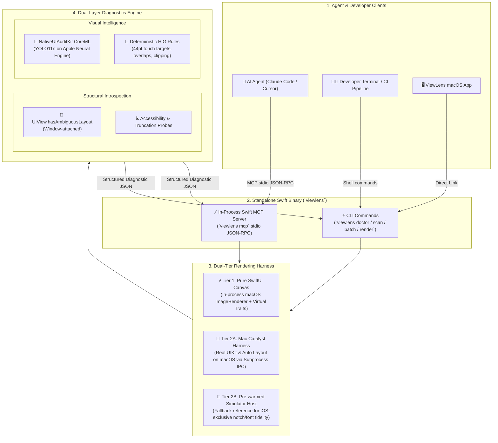

# ViewLens 🔍

> **100% Pure Swift AI Agent MCP Server, Dual-Tier Visual Canvas & UI Audit CLI for Native Apple Platforms**

[](https://developer.apple.com/macos/)
[](https://swift.org)
[](https://developer.apple.com/documentation/coreml)
[](https://www.w3.org/WAI/standards-guidelines/wcag/)
[](Docs/ViewLens-Nonvisual-Authoring-Guide.md)
[](https://modelcontextprotocol.io)
[](https://swift.org)
[](LICENSE)

---

## Overview

**ViewLens** is a single, standalone native macOS CLI and Model Context Protocol (MCP) server that connects AI coding agents (Claude Code, Cursor, Windsurf, Xcode AI) and software engineers—**including blind and low-vision developers**—to native Apple UI layouts, W3C WCAG 2.2 accessibility validation, and Apple HIG compliance.

**100% Pure Swift**: The MCP server runs directly inside the native `viewlens` binary (`viewlens mcp`) using in-process Swift JSON-RPC 2.0.

By combining an ultra-fast **dual-tier headless canvas renderer** with the fine-tuned CoreML vision models trained in [NativeUIAuditKit](https://github.com/SerialForBreakfast/NativeUIAuditKit), ViewLens detects UI elements, evaluates Apple Human Interface Guidelines (HIG), and performs programmatic Auto Layout introspection **without burning multimodal LLM tokens on raw image uploads or waiting for multiple iOS simulator boots**.

### Why ViewLens?

- ♿ **Pioneering Nonvisual Authoring for Blind Developers**: Transforms visual Xcode canvas previews and simulators into VoiceOver-accessible hierarchies, spoken speech streams, 40-cell braille simulations, and semantic spatial queries.
- 🎯 **W3C WCAG 2.2 Level A/AA/AAA Auditing**: Enforces programmatic Name/Role/Value (4.1.2), level-aware Touch Target sizing (2.5.8 AA / 2.5.5 AAA), Light/Dark contrast (1.4.3 / 1.4.6), and Dynamic Type AX1–AX5 reflow.
- 🧠 **Token-Free UI Audits**: LLMs receive structured JSON coordinate geometry (`x`, `y`, `width`, `height` in normalized top-left space) and semantic issue classifications rather than raw image pixels.
- 🏎️ **Dual-Tier Headless Canvas (Zero Simulator Boot Matrix)**:
  - **SwiftUI Views**: Rendered in-process on macOS via `ImageRenderer` in $<5\text{ms}$ with injected device dimensions, Dynamic Type sizes, and color schemes.
  - **UIKit Views & ViewControllers**: Rendered via a **Mac Catalyst harness** running the real Apple UIKit and Auto Layout engine directly on macOS.
- 🔍 **Root-Cause + Visual Symptom Diagnostics**:
  - **Structural Introspection**: Programmatically detects ambiguous layout via `UIView.hasAmbiguousLayout` and constraint conflicts.
  - **Visual Intelligence**: YOLO11n CoreML vision model catches sub-44pt touch targets, boundary clipping, text truncation, and cross-element overlaps.
- 📐 **Direct SwiftUI / UIKit Alignment**: Bounding boxes match SwiftUI `.frame(x:y:width:height:)` and UIKit coordinate conventions directly—no Y-axis inversion needed.
- 🚦 **CI/CD Quality Gates**: Enforces strict layout verification in CI pipelines with `--strict` exit codes.

---

## System Architecture



---

## Key CLI Commands

### 1. `viewlens doctor`
Pre-flight readiness probe verifying that the CoreML model is located, passes size validation, and performs a cold-load warmup test.

```bash
viewlens doctor --json
```

```json
{
  "status": "ready",
  "checks": [
    { "name": "model_found", "status": "confirmed", "detail": "/path/to/best.mlpackage" },
    { "name": "model_size", "status": "confirmed", "detail": "4.8MB (< 25MB threshold)" },
    { "name": "model_loads", "status": "confirmed", "detail": "Cold load: 0.84s" }
  ],
  "recommendedNextCommand": "viewlens scan <image-path>"
}
```

### 2. `viewlens scan`
Audits one or more screenshot images. In multi-image mode, the CoreML model is loaded once into memory to process all targets efficiently.

```bash
# Human-friendly visual table output
viewlens scan ./screenshots/HomeScreen.png

# Agent-friendly structured JSON with annotated bounding box overlay output
viewlens scan ./screenshots/Login.png --format json --overlay ./reports/Login_annotated.png

# Strict CI mode (exits 1 if any layout or accessibility violations are discovered)
viewlens scan ./screenshots/Profile.png --strict
```

### 3. `viewlens batch`
Audits entire directory trees containing test artifacts or simulator outputs, producing a consolidated JSON audit report.

```bash
viewlens batch ./DerivedData/Screenshots --pattern "png" --output ./audit_report.json
```

### 4. `viewlens render`
Renders and audits a SwiftUI/UIKit template across a multi-device matrix in memory without simulators:

```bash
# Audits template across iPhone SE and iPhone 16 Pro in Light and Dark mode
viewlens render --template LoginForm --devices iPhoneSE,iPhone16Pro --dt large,accessibility3 --scheme light,dark

# Output structured JSON report
viewlens render --template LoginForm --format json
```

### 5. `viewlens tui`
Launches the interactive full-screen Terminal User Interface (TUI) or headless ASCII layout dashboard:

```bash
# Interactive full-screen terminal dashboard with live keyboard shortcuts
viewlens tui

# Headless snapshot output for CI or SSH sessions
viewlens tui --headless --template LoginForm
```

### 6. `viewlens hook` (Pre-Commit & CI Quality Gates)
Executes automated quality gates enforcing Apple HIG, Touch Targets (≥44pt), Dynamic Type reflow, and Dark Mode:

```bash
# Fast pre-commit audit on staged views (<1s)
viewlens hook pre-commit

# Strict CI / PR check generating GitHub Markdown step summaries
viewlens hook pull-request --output-markdown reports/pr_summary.md

# Install git pre-commit hook in local repository
viewlens install-hook --type pre-commit

# Generate starter .viewlens.json configuration
viewlens init-config
```

### 7. `viewlens accessibility`
Runs a level-aware WCAG 2.2 audit. Template audits evaluate programmatic semantics, 24pt AA or 44pt AAA target sizing, Light/Dark contrast, AX1/AX3/AX5 reflow, and portrait/landscape rendering. UIKit semantics come from live hierarchy introspection; headless SwiftUI templates use registered semantic snapshots. Screenshot-only and unregistered-template audits explicitly mark checks that cannot be established as not evaluated.

```bash
viewlens accessibility --template LoginForm --level AA
viewlens accessibility --image ./screenshots/Login.png --level AAA --json
```

### 8. `viewlens design-diff`
Compares a rendered template with a Figma or baseline reference using SSIM and an optional visual heatmap, with accessibility verification enabled by default.

```bash
viewlens design-diff --reference ./designs/Login.png --template LoginForm --heatmap ./reports/Login_diff.png
```

### 9. `viewlens mcp`
Launches the 100% pure Swift Model Context Protocol (MCP) server over standard I/O (`stdio`):

```bash
viewlens mcp
```

---

## ♿ Accessibility & Nonvisual Authoring for Blind Developers

Historically, blind and low-vision Apple platform developers have faced a steep barrier: Xcode's SwiftUI Canvas previews, Interface Builder, and running iOS Simulator windows are visual-only pixels that cannot be meaningfully inspected with a screen reader. 

ViewLens solves this by converting visual UI layouts, device permutations, and accessibility trees into a **structured, VoiceOver-first nonvisual authoring environment and automated WCAG 2.2 / Apple HIG auditing engine**.

For full workflows, keyboard maps, and agent prompts, see the [ViewLens Nonvisual Authoring Guide](Docs/ViewLens-Nonvisual-Authoring-Guide.md).

```mermaid
flowchart LR
    subgraph Input["1. Layout Source"]
        SwiftUI["SwiftUI / UIKit Code"]
        Shot["Screenshot / Simulator"]
    end

    subgraph NonvisualEngine["2. Nonvisual Authoring Engine"]
        Model["🧠 NonvisualScreenModel<br/>(Scalar Stable IDs)"]
        VOPredict["🗣️ VoiceOverPredictor<br/>(Reading Order & Rotor)"]
        Braille["⠃⠗⠇ Braille Simulation<br/>(40-Cell Pin Map)"]
        Correlate["🔬 Visual-Semantic Correlator<br/>(CoreML vs AX Hierarchy)"]
        Focus["🕸️ Focus Graph Engine<br/>(Trap & Cycle Detection)"]
    end

    subgraph Output["3. VoiceOver-Accessible Interfaces"]
        MacApp["🖥️ macOS Dual-Pane Outline (⌥⌘O)"]
        TUI["📟 Terminal Dashboard (viewlens tui)"]
        MCP["🤖 AI Coding Agents (16 MCP Tools)"]
    end

    Input --> NonvisualEngine
    NonvisualEngine --> Output
```



### 1. The Nonvisual Screen Model (`NonvisualScreenModel`)
ViewLens transforms any SwiftUI/UIKit view or screenshot into a structured, scalar `NonvisualScreenModel` with deterministic identifiers (`screen_...`, `elem_...`, `finding_...`). Blind developers can inspect bounds, hierarchical parents, and spatial relationships without sighted assistance.

### 2. Spoken VoiceOver Simulation & Simulated Braille Displays
- **Spoken Speech Streams**: Predicts the exact text phrases VoiceOver will speak as a user swipes through the screen.
- **Simulated 40-Cell Braille**: Formats refreshable braille pin displays for braille users.
- **Rotor Inventory**: Catalogs heading levels, form controls, and custom accessibility actions.
- **Announcement Storm Detection**: Flags rapid speech bursts ($<0.5\text{s}$) and duplicate announcements.

### 3. Bi-Directional "Visual-Semantic Correlation" (The Invisible Bug Finder)
Cross-references on-device YOLO CoreML computer vision (what sighted users see) with the native accessibility hierarchy (what VoiceOver reads):
- **Catches Missing Semantics**: Alerts when an interactive visual button lacks `.accessibilityAddTraits(.isButton)` or `.accessibilityLabel`.
- **Catches Invisible / Obscured Nodes**: Alerts when an accessibility node exists in code but is clipped off-screen or renders with 0x0 pixels.
- **Flags Role Conflicts**: Detects when visual styling (e.g. primary button) conflicts with programmatic accessibility traits.

### 4. Keyboard Focus Traps & Sequential Order Graphs
Constructs the directed graph of sequential keyboard and switch-control navigation:
- Automatically detects **focus traps** (loops where focus cannot escape a modal or card).
- Identifies **unreachable elements** that cannot be focused via keyboard or assistive switches.

### 5. Dual-Pane Outline & Terminal Dashboard
- **macOS Desktop App (`ViewLens.app`)**: Features a VoiceOver-accessible dual-pane outline with dedicated keyboard shortcuts (`⌥⌘O` to toggle outline, `⌥⌘L` for landmarks, `⌥⌘S` for spatial relationships, `⌥⌘I` for findings).
- **Interactive Terminal UI (`viewlens tui`)**: Provides a full-screen, keyboard-navigable ASCII layout and semantic list that works over SSH and in terminal environments.

### 6. W3C WCAG 2.2 & Apple HIG Compliance Matrix

| WCAG Criterion | Conformance Level | ViewLens Automated Check |
|---|---|---|
| **WCAG 4.1.2** (Name, Role, Value) | Level A | Verifies all interactive controls expose programmatic names, roles, and required state values. |
| **WCAG 2.5.8** (Target Size Minimum) | Level AA | Enforces **24x24pt minimum touch target** with adjacent spacing exceptions. |
| **WCAG 2.5.5** (Target Size Enhanced) | Level AAA | Enforces **44x44pt Apple HIG enhanced touch target** minimums. |
| **WCAG 1.4.3** (Contrast Minimum) | Level AA | Verifies **4.5:1 text contrast** across Light and Dark appearance modes. |
| **WCAG 1.4.6** (Contrast Enhanced) | Level AAA | Verifies **7.0:1 enhanced text contrast**. |
| **Dynamic Type Reflow** | Level AA / HIG | Tests reflow from **Default (100%) to AX5 (312%)**, flagging text clipping and overflows. |

---

## MCP Server Integration (Claude Code & Cursor)

### 1. Claude Code Configuration (`~/.claude/settings.json`)

```json
{
  "mcpServers": {
    "viewlens": {
      "command": "/path/to/ViewLens/.build/release/viewlens",
      "args": ["mcp"],
      "env": {
        "VIEWLENS_MODEL_PATH": "/path/to/NativeUIAuditKit/models/best.mlpackage"
      }
    }
  }
}
```

### 2. Cursor Configuration (`.cursor/mcp.json`)

```json
{
  "mcpServers": {
    "viewlens": {
      "command": "/path/to/ViewLens/.build/release/viewlens",
      "args": ["mcp"]
    }
  }
}
```

Or run the automated setup script:
```bash
./scripts/install_mcp.sh
```

---

## Exposed MCP Tools (16 Modern Tools)

| Tool Name | Scope & Parameters | Capability Description |
|-----------|--------------------|------------------------|
| `viewlens_doctor` | `model_path?: string` | Verifies CoreML model paths, Neural Engine latency, and platform capability health. |
| `viewlens_audit_screenshot` | `image_path: string`, `overlay_path?: string` | Runs YOLO11n CoreML detection and HIG layout checks on screenshot artifacts. |
| `viewlens_audit_view` | `template: string`, `devices?: string[]`, `dynamic_type_sizes?: string[]` | Renders SwiftUI/UIKit view matrix across device dimensions, AX sizes, and color schemes in $<5\text{ms}$. |
| `viewlens_accessibility_audit` | `template?: string`, `image_path?: string`, `wcag_level?: string` | Complete WCAG 2.2 mobile accessibility audit (Name/Role/Value 4.1.2, Touch Targets 2.5.8/2.5.5, Contrast 1.4.3). |
| `viewlens_design_diff` | `reference_image: string`, `template: string`, `heatmap?: string` | Performs SSIM design verification against Figma reference exports with pixel delta heatmap generation. |
| `viewlens_destinations_list` | `workspace_root?: string` | Discovers macOS host apps and available Apple iOS Simulator destinations. |
| `viewlens_session_create` | `destination_id: string`, `workspace_root?: string`, `ttl_seconds?: int` | Allocates an expiring runtime review session with leased ownership and keepalive renewal. |
| `viewlens_session_get` | `session_id: string` | Inspects status, active lease expiration, and diagnostics for a review session. |
| `viewlens_session_close` | `session_id: string` | Releases and terminates an active runtime review session. |
| `viewlens_app_launch` | `bundle_identifier: string`, `destination_id?: string`, `launch_arguments?: string[]` | Launches target applications under strict security policies (sanitized environment, workspace scoping). |
| `viewlens_query_hierarchy` | `template: string`, `query?: string`, `role?: string`, `parent_id?: string` | Token-efficient query filtering accessibility nodes by label, role, or descendant tree. |
| `viewlens_query_spatial` | `template: string`, `x?: float, y?: float` or `element_a: string, element_b: string` | Computes point containment, Euclidean nearest neighbor, or directional relationships (`above`, `below`, `inside`). |
| `viewlens_capture_state` | `template: string`, `appearance?: string`, `scale?: float` | Captures atomic snapshot of visual rendering, accessibility tree, and bi-directional correlation. |
| `viewlens_ui_perform` | `action: string`, `element_id?: string`, `text?: string`, `direction?: string` | Executes allowlisted UI actions (`activate`, `type_text`, `scroll`, `swipe`) with automatic credential sanitization. |
| `viewlens_flow_replay` | `template: string`, `name: string`, `actions: object[]` | Replays multi-step UI interaction scripts with declared assertions across state transitions. |
| `viewlens_accessibility_graph` | `template: string` | Analyzes sequential keyboard focus order, natural reading order, and flags focus traps. |

---

## ✨ Cool Tricks & Unique Capabilities

ViewLens offers unique native Apple platform capabilities that set it apart from standard web testing and general multimodal AI tools:

### 1. 🧠 Zero-Token Vision Auditing (<100 tokens vs 2,000+ per image)
Traditional AI agents burn thousands of multimodal vision tokens uploading raw high-res screenshots to external APIs. ViewLens runs **YOLO11n CoreML inference locally on the Apple Neural Engine (ANE)** in $<10\text{ms}$. It passes back compact, structured JSON bounding boxes `[x, y, w, h]` and classified layout defects—saving **95%+ in token costs** and eliminating API latency.

### 2. 🏎️ In-Process Multi-Device Rendering Matrix (No Simulator Boots)
Forget waiting 30 seconds for iOS simulators to boot. ViewLens renders SwiftUI templates directly in-process on macOS via `ImageRenderer`:
- Permutes across **iPhone SE (3rd gen)**, **iPhone 16 Pro**, **iPad Pro (13-inch)**, and **Landscape** in under $5\text{ms}$ per frame.
- Simulates **Dynamic Type sizes from Default (100%) to AX5 (312%)**, instantly exposing text clipping and button overflows before committing code.

### 3. 🔬 Bi-Directional Visual-Semantic Correlation
ViewLens correlates computer vision bounding boxes with programmatic accessibility nodes:
- **Catches Missing Semantics**: Identifies visual buttons that look like buttons but lack `.accessibilityAddTraits(.isButton)` or `.accessibilityLabel`.
- **Catches Obscured Elements**: Identifies accessibility elements that exist in the hierarchy but are off-screen, clipped, or have 0-pixel bounds.
- **Flags Role Conflicts**: Alerts you when a visual element classification disagrees with programmatic accessibility roles.

### 4. 🧭 Directional Layout & Spatial Proximity Queries
AI coding agents don't have human spatial vision, but with `viewlens_query_spatial` they can ask:
- *"What element is at coordinate (0.5, 0.35)?"*
- *"What is the nearest interactive control to the user's touch point?"*
- *"Is the Header `.above` the Save Button, or are they `.overlapping`?"*
- *"Is the Icon `.inside` the Container view?"*

### 5. 🎯 SSIM Perceptual Heatmap Diffing (Figma Design-to-Code)
Verify implementation fidelity against Figma exports using Structural Similarity (SSIM):
- Generates pixel-delta heatmaps highlighting layout drifts, color shifts, and padding discrepancies.
- Computes exact match percentages and classifies whether design deltas violate HIG spacing or WCAG contrast.

### 6. ♿ Nonvisual Screen Modeling & VoiceOver Prediction
ViewLens builds a complete nonvisual model of your UI:
- Simulates natural **VoiceOver reading order** and rotor navigation sequences.
- Generates spoken speech strings and simulated refreshable braille display outputs.
- Detects announcement bursts ($<0.5\text{s}$) and duplicate speech messages.

### 7. 🕸️ Focus Trap & Keyboard Traversal Graph
With `viewlens_accessibility_graph`, ViewLens builds a directed graph of sequential keyboard and switch-control navigation:
- Automatically detects **focus traps** (circular focus cycles where a user cannot tab out of a modal or card).
- Identifies **unreachable elements** that cannot be navigated to via sequential keyboard or assistive switches.

### 8. 🛡️ Safe UI Interaction Engine with Credential Scrubbing
When an AI agent interacts with your app via `viewlens_ui_perform` or `viewlens_flow_replay`:
- Automatically rejects and redacts **Bearer tokens, API keys, and sensitive patterns**.
- Prevents typing credentials into password fields.
- Replays declared multi-step user workflows deterministically and verifies step assertions (`element_exists`, `element_contains_text`).

### 9. 🚦 Targeted Fix Verification & Regression Delta Engine
When you fix an issue, ViewLens compares your before-and-after audit runs and categorizes findings into:
- **`resolvedIssues`**: Violations successfully eliminated.
- **`remainingIssues`**: Unresolved existing issues.
- **`introducedIssues`**: **Regressions!** Any new defects created by your code change.

### 10. 📝 Zero-Setup Git Hooks & Markdown PR Summaries
Run `viewlens hook pre-commit` for sub-second pre-commit checks, or generate gorgeous GitHub Markdown step summaries in your CI/CD pipelines with `viewlens hook pull-request --output-markdown pr_summary.md`.

---

## Coordinate System & Diagnostic Schema

ViewLens outputs coordinates in **normalized top-left space `[0.0, 1.0]`**, matching SwiftUI `.frame()` and UIKit coordinate systems.

```
(0,0) ────────────────────────── (1,0)
  │                                │
  │    ┌──────────────────┐        │
  │    │  (x, y)          │        │
  │    │   BoundingBox    │ height │
  │    │                  │        │
  │    └────── width ─────┘        │
  │                                │
(0,1) ────────────────────────── (1,1)
```

### Diagnostic Output JSON

```json
{
  "sourceMode": "screenshot",
  "image": "screenshots/checkout_screen.png",
  "dimensions": { "width": 1179, "height": 2556, "scale": 3.0 },
  "elements": [
    {
      "type": "primaryButton",
      "confidence": 0.962,
      "boundingBox": { "x": 0.05, "y": 0.88, "width": 0.90, "height": 0.048 }
    }
  ],
  "issues": [
    {
      "kind": "tappableTargetTooSmall",
      "severity": "error",
      "description": "primaryButton height 38pt (114px @3x) is below Apple HIG requirement of 44x44pt.",
      "confidence": 0.962,
      "elementIndex": 0,
      "remediation": {
        "description": "Increase frame dimensions to at least 44x44pt.",
        "codeSnippet": ".frame(minWidth: 44, minHeight: 44)"
      }
    }
  ],
  "passed": false,
  "summary": {
    "totalElements": 1,
    "totalIssues": 1,
    "errorCount": 1,
    "warningCount": 0,
    "worstIssue": "primaryButton height 38pt (114px @3x) is below Apple HIG requirement of 44x44pt."
  }
}
```

---

## License

ViewLens is open source software released under the [MIT License](LICENSE).
