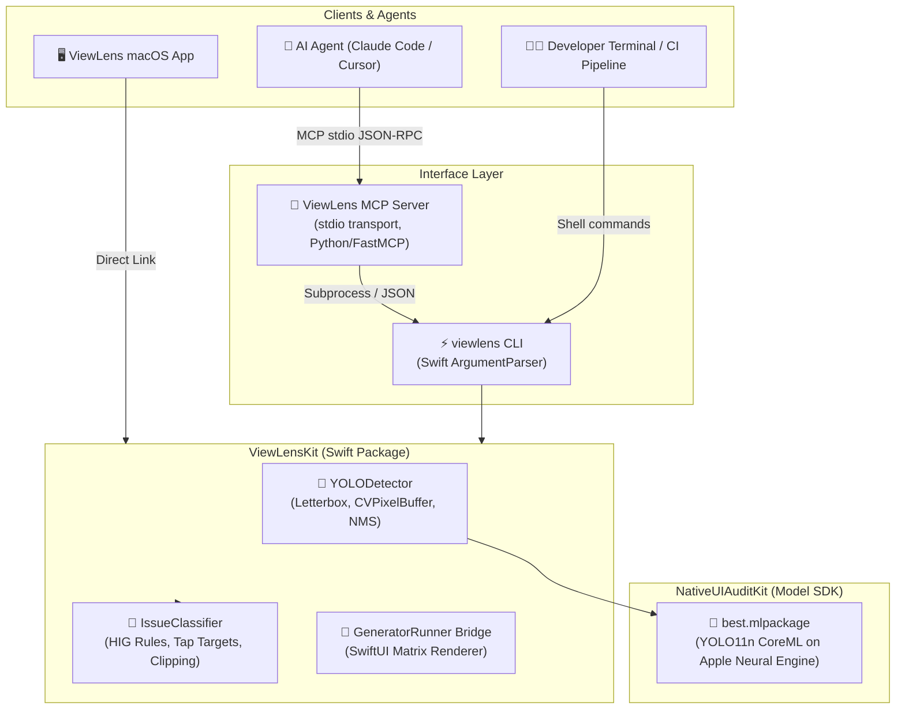

# ViewLens 🔍

> **AI Agent MCP Server & Visual UI Audit CLI for Native Apple Platforms**

[](https://developer.apple.com/macos/)
[](https://swift.org)
[](https://developer.apple.com/documentation/coreml)
[](https://github.com/SerialForBreakfast/NativeUIAuditKit)
[](https://modelcontextprotocol.io)
[](LICENSE)

---

## Overview

**ViewLens** is the macOS CLI binary, Model Context Protocol (MCP) server, and companion desktop inspector that connects AI coding agents (Claude Code, Cursor, Windsurf, Xcode AI) to native Apple UI layouts.

By consuming the fine-tuned CoreML vision models trained in [NativeUIAuditKit](https://github.com/SerialForBreakfast/NativeUIAuditKit), ViewLens detects UI elements (navigation bars, buttons, toggles, text fields, tab bars) and performs deterministic Apple Human Interface Guidelines (HIG) audits **without burning multimodal LLM tokens on raw image uploads**.

### Why ViewLens?

- 🧠 **Token-Free UI Audits**: LLMs receive structured JSON coordinate geometry (`x`, `y`, `width`, `height` in normalized top-left space) and semantic issue classifications rather than raw image pixels.
- ⚡ **ANE-Accelerated Speed**: Runs on the Apple Neural Engine (ANE) and GPU via CoreML in <15ms per frame.
- 📐 **Direct SwiftUI / UIKit Alignment**: Bounding boxes match SwiftUI `.frame(x:y:width:height:)` and UIKit coordinate conventions directly—no Y-axis inversion or conversion needed.
- 🛡️ **Zero Behavioral Drift**: The CLI (`viewlens`) is the single source of truth. The MCP server is a thin wrapper that invokes the CLI in-process or via subprocess.
- 🚦 **CI/CD Quality Gates**: Enforces strict layout verification in CI pipelines with `--strict` exit codes.
- 🖥️ **Native macOS Desktop Companion**: Includes a dedicated SwiftUI desktop application for visual inspection, side-by-side issue overlays, and interactive debugging.

---

## System Architecture



---

## Key Features

### 1. `viewlens doctor`
Pre-flight readiness probe verifying that the CoreML model is located, passes size and checksum validations, and performs a cold-load warmup. Agents must invoke this check before running scans.

```bash
viewlens doctor --json
```

```json
{
  "status": "ready",
  "checks": [
    { "name": "model_found", "status": "confirmed", "detail": "/path/to/best.mlpackage" },
    { "name": "model_size", "status": "confirmed", "detail": "4.8MB (< 15MB threshold)" },
    { "name": "model_loads", "status": "confirmed", "detail": "Cold load: 0.84s" }
  ],
  "recommendedNextCommand": "viewlens scan <image-path>"
}
```

### 2. `viewlens scan`
Audits one or more screenshot images. In multi-image mode, the CoreML model is loaded once into memory to process all targets efficiently.

```bash
# Human-friendly visual table output
viewlens scan ./screenshots/HomeScreen.png

# Agent-friendly structured JSON with annotated bounding box overlay output
viewlens scan ./screenshots/Login.png --format json --overlay ./reports/Login_annotated.png

# Strict CI mode (exits 1 if any layout or accessibility violations are discovered)
viewlens scan ./screenshots/Profile.png --strict
```

### 3. `viewlens batch`
Audits entire directory trees containing test artifacts or simulator outputs, producing a consolidated JSON audit report.

```bash
viewlens batch ./DerivedData/Screenshots --pattern "*.png" --output ./audit_report.json
```

### 4. `viewlens render` *(Milestone 2)*
Invokes the SwiftUI rendering harness across a matrix of devices, Dynamic Type sizes, and color schemes, piping rendered views directly into the audit pipeline without saving intermediate files.

```bash
viewlens render --template LoginForm --device "iPhone 16 Pro" --dt accessibility3 --scheme dark
```

---

## MCP Server Integration

The ViewLens MCP Server exposes local, read-only tools to AI agents using standard `stdio` transport.

### Available Tools

| Tool Name | Parameters | Description |
|-----------|------------|-------------|
| `viewlens_doctor` | *None* | Verifies model existence, load times, and environment health. |
| `viewlens_audit_screenshot` | `imagePath` (string), `minConfidence` (number, opt), `scale` (number, opt) | Runs YOLO detection and HIG issue classification on a screenshot. |
| `viewlens_audit_swiftui_view` *(M2)* | `template` (string), `devices` (array), `dynamicTypeSizes` (array), `colorSchemes` (array) | Renders a SwiftUI matrix and performs multi-device layout audit. |

### Claude Code Setup (`~/.claude/settings.json`)

```json
{
  "mcpServers": {
    "viewlens": {
      "command": "python3",
      "args": ["/path/to/ViewLens/mcp-server/server.py"],
      "env": {
        "VIEWLENS_MODEL_PATH": "/path/to/NativeUIAuditKit/models/best.mlpackage"
      }
    }
  }
}
```

Or install automatically via the provided script:
```bash
./scripts/install_mcp.sh
```

---

## Coordinate System & Data Schema

To eliminate friction when agents translate audit findings into code fixes, ViewLens outputs coordinates in **normalized top-left space `[0.0, 1.0]`**, matching SwiftUI `.frame()` and UIKit coordinate systems.

```
(0,0) ────────────────────────── (1,0)
  │                                │
  │    ┌──────────────────┐        │
  │    │  (x, y)          │        │
  │    │   BoundingBox    │ height │
  │    │                  │        │
  │    └────── width ─────┘        │
  │                                │
(0,1) ────────────────────────── (1,1)
```

### JSON Output Schema

```json
{
  "image": "screenshots/checkout_screen.png",
  "imageSize": { "width": 1179, "height": 2556 },
  "scale": 3.0,
  "elements": [
    {
      "type": "primaryButton",
      "confidence": 0.962,
      "boundingBox": {
        "x": 0.05,
        "y": 0.88,
        "width": 0.90,
        "height": 0.055
      }
    }
  ],
  "issues": [
    {
      "kind": "tappableTargetTooSmall",
      "severity": "error",
      "description": "primaryButton height is 38pt (114px @3x), which is below the Apple HIG minimum requirement of 44pt (132px).",
      "confidence": 0.962,
      "elementIndex": 0
    }
  ],
  "passed": false
}
```

---

## Detection & Audit Rules Engine

ViewLens implements deterministic Apple HIG rule evaluation:

| Rule Name | Condition | HIG Standard |
|-----------|-----------|--------------|
| `tappableTargetTooSmall` | Interactive element height or width $< 44\text{pt} \times \text{scale}$ | Minimum $44 \times 44\text{pt}$ touch target |
| `clippedElement` | Element edge $< 2\text{px}$ from screen border without safe area margin | Content clipping prevention |
| `overlappingElements` | Cross-class bounding box $\text{IoU} > 0.30$ | Layout occlusion prevention |
| `offScreen` | Over $50\%$ of element area lies outside visible viewport | View bounds containment |

---

## Project Structure

```
ViewLens/
├── Package.swift                    # SPM manifest defining ViewLensKit & viewlens CLI
├── Sources/
│   ├── ViewLensKit/                 # Core inference, geometry, and rules engine
│   │   ├── Models/
│   │   │   ├── BoundingBox.swift
│   │   │   ├── DetectedElement.swift
│   │   │   └── ViewLensIssue.swift
│   │   ├── Detector/
│   │   │   ├── YOLODetector.swift
│   │   │   └── NMS.swift
│   │   ├── Rules/
│   │   │   ├── IssueClassifier.swift
│   │   │   └── HIGRule.swift
│   │   └── Rendering/
│   │       └── OverlayRenderer.swift
│   └── ViewLensCLI/                 # CLI binary executable (nativeui-audit / viewlens)
│       ├── main.swift
│       ├── Commands/
│       │   ├── DoctorCommand.swift
│       │   ├── ScanCommand.swift
│       │   ├── BatchCommand.swift
│       │   └── RenderCommand.swift (M2)
│       └── Formatters/
│           ├── JSONFormatter.swift
│           └── TableFormatter.swift
├── ViewLens/                        # macOS Desktop SwiftUI Application
│   ├── ViewLensApp.swift
│   ├── ContentView.swift
│   └── Views/
├── Tests/
│   ├── ViewLensKitTests/
│   └── ViewLensCLITests/
├── mcp-server/                      # Python MCP stdio server
│   ├── server.py
│   ├── requirements.txt
│   └── README.md
├── .agents/
│   └── skills/
│       └── viewlens/
│           └── SKILL.md             # Agent workflow playbook & prompt guidelines
├── scripts/
│   ├── install_mcp.sh               # Quick installer for Claude Code / Cursor
│   └── download_model.sh            # Model asset downloader / sync
└── TASKS.md                         # Detailed work breakdown & task tracker
```

---

## Quick Start & Development

### Prerequisites

- macOS 15.0+ (Sequoia)
- Xcode 16.0+ with Command Line Tools
- Swift 6.0 toolchain
- Python 3.10+ (for MCP server wrapper)

### 1. Build the CLI Binary

```bash
swift build -c release --product viewlens
```

### 2. Run Diagnostics

```bash
.build/release/viewlens doctor
```

### 3. Run Test Suite

```bash
swift test
```

---

## Model SDK Relationship

ViewLens is strictly decoupled from model training:
- **Model Training & Dataset Pipeline**: [NativeUIAuditKit](https://github.com/SerialForBreakfast/NativeUIAuditKit) (generates YOLO11n CoreML packages).
- **Inference & Agent Consumption**: **ViewLens** (this repository).

ViewLens resolves the model in the following priority order:
1. `--model <path>` explicit command line argument
2. `VIEWLENS_MODEL_PATH` environment variable
3. `NATIVEUI_MODEL_PATH` environment variable
4. Sibling directory `../NativeUIAuditKit/models/best.mlpackage`
5. Application Support / bundled assets `~/Library/Application Support/ViewLens/models/best.mlpackage`

---

## License

ViewLens is open source software released under the [MIT License](LICENSE).
