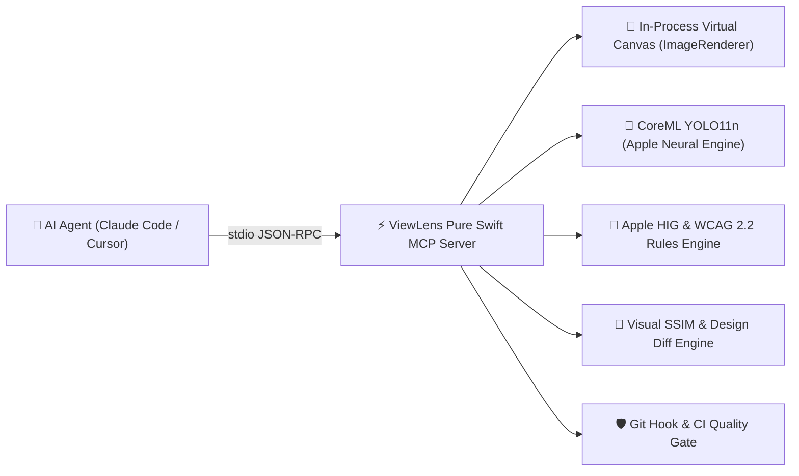

# ViewLens — Agent Skill Playbook & Tool Reference

**ViewLens** is an Apple UI visual layout auditor, Human Interface Guidelines (HIG) compliance validator, W3C WCAG 2.2 accessibility checker, and headless matrix rendering engine for native iOS and macOS applications.

It provides AI agents with deep visual layout intelligence **without bloating the agent's LLM context window with raw image tokens**.

---

## 1. Core Architecture & Mental Model



### Detection Capabilities:
- `navigationBar`
- `primaryButton`
- `tabBar`
- `textField`
- `toggle`

### Deterministic HIG, WCAG 2.2, & Design Diff Rules:
- `tappableTargetTooSmall` (**WCAG 2.5.8 AA / 2.5.5 AAA**): Applies the 24×24pt AA minimum with its spacing exception, or the enhanced 44×44pt AAA target policy.
- `contrastRisk` (**WCAG 1.4.3 AA / 1.4.11 AA**): Text/icon luminance contrast ratio $< 4.5:1$ (normal) or $< 3.0:1$ (large text/icons) in Light or Dark Mode.
- `clippedElement` / `offScreen` (**Apple HIG mobile safe-area check**): Controls placed $< 3\text{pt}$ from viewport/safe-area borders without margins.
- `dynamicTypeOverflow` / `overlappingElements` (**WCAG 1.4.10 AA / 1.4.4 AA**): Loss of content, collision, or clipping at AX1, AX3, and AX5.
- Portrait/landscape rendering (**WCAG 1.3.4 AA**): Verifies the UI is not restricted to one display orientation.
- `ambiguousAutoLayout`: Under-constrained UIKit view hierarchies.
- `missingAccessibilityLabel` / `missingAccessibilityTrait` (**WCAG 4.1.2 A**): Missing programmatic name, role, state, or required value. UIKit uses live hierarchy introspection; SwiftUI templates use registered semantic snapshots because `ImageRenderer` does not expose an accessibility tree. Screenshot-only and unregistered-template audits report this criterion as not evaluated.

---

## 2. Pure Swift MCP Tools Reference

ViewLens exposes 5 standard JSON-RPC tools over `stdio`:

### 1. `viewlens_doctor`
Probes environment, Apple Neural Engine readiness, and CoreML model status.
- **Arguments**: `{}`
- **When to use**: Call once at session start to verify detector availability.

### 2. `viewlens_design_diff`
Performs Design-to-Code verification comparing a Figma reference design image against a rendered native SwiftUI view.
- **Arguments**:
  - `reference_image` (string, required): Path to reference PNG (from Figma or design baseline).
  - `template` (string, required): Registered SwiftUI view template name.
  - `device` (string, optional): Target device profile (default `"iPhone16Pro"`).
  - `ssim_threshold` (number, optional): Minimum Structural Similarity Index (SSIM) score (default `0.98`).
  - `heatmap_path` (string, optional): Path to write annotated visual diff heatmap PNG.
  - `check_accessibility` (boolean, optional): Whether to run WCAG accessibility audits concurrently (default `true`).

### 3. `viewlens_accessibility_audit`
Performs a full W3C WAI & WCAG 2.2 mobile accessibility audit on a SwiftUI template or screenshot image.
- **Arguments**:
  - `template` (string, optional): Registered SwiftUI template name (e.g. `LoginForm`, `CheckoutView`, `SocialFeedView`).
  - `image_path` (string, optional): Path to screenshot image.
  - `wcag_level` (string, optional): Target level (`"A"`, `"AA"`, or `"AAA"`; default `"AA"`). Specify exactly one of `template` and `image_path`.
- **Returns**: Structured compliance and completeness, category scores, programmatic semantics, level-aware target size, Light/Dark contrast, AX1/AX3/AX5 reflow, portrait/landscape orientation, mobile safe-area findings, and remediation snippets.

### 4. `viewlens_audit_view`
Renders a SwiftUI view template across a multi-device matrix entirely in-memory in $<0.5\text{s}$.
- **Arguments**:
  - `template` (string, required): Registered SwiftUI template name.
  - `devices` (array of strings, optional): `["iPhoneSE", "iPhone16Pro", "iPadPro11"]`.
  - `dynamic_type_sizes` (array of strings, optional): `["large", "accessibility3", "accessibility5"]`.
  - `color_schemes` (array of strings, optional): `["light", "dark"]`.
- **Response Mode**: `sourceMode: "rendered"` with synthesized worst-case issue matrix.

### 5. `viewlens_audit_screenshot`
Audits static image files (simulator screenshots, test artifacts, mocks).
- **Arguments**:
  - `image_path` (string, required): Path to PNG/JPEG image.
  - `scale` (number, optional): Explicit display scale (@2x, @3x).
  - `min_confidence` (number, optional): Minimum detection confidence (default `0.15`).

---

## 3. CLI Command Suite Reference

When executing commands in the terminal, use the `viewlens` CLI binary:

| Command | Purpose | Example |
|---|---|---|
| `viewlens nonvisual` | Screen-reader optimized nonvisual summary and outline | `viewlens nonvisual --template LoginForm --profile speech` |
| `viewlens design-diff` | Figma design-to-code visual & structural verification | `viewlens design-diff --reference figma.png --template LoginForm` |
| `viewlens accessibility` | Comprehensive W3C / WCAG 2.2 accessibility audit | `viewlens accessibility --template LoginForm --level AA` |
| `viewlens doctor` | Model readiness and system check | `viewlens doctor --json` |
| `viewlens scan <image>` | Single/multi-image screenshot audit | `viewlens scan ./screenshot.png --strict` |
| `viewlens batch <dir>` | Recursive folder screenshot audit | `viewlens batch ./DerivedData/Screenshots` |
| `viewlens render` | Headless multi-device template matrix audit | `viewlens render --template LoginForm --devices iPhoneSE,iPhone16Pro` |
| `viewlens tui` | Interactive terminal UI / headless ASCII dashboard | `viewlens tui --headless --template LoginForm` |
| `viewlens hook <gate>` | Executes Git Hook or CI Quality Gate | `viewlens hook pre-commit --fail-on error` |
| `viewlens install-hook` | Installs `.git/hooks/pre-commit` | `viewlens install-hook --type pre-commit` |
| `viewlens init-config` | Generates `.viewlens.json` configuration | `viewlens init-config` |
| `viewlens export-skill` | Exports this AI Agent Skill Playbook | `viewlens export-skill --output ViewLensSkill.md` |
| `viewlens mcp` | Starts the native Swift MCP stdio server | `viewlens mcp` |

---

## 5. Nonvisual MCP Resources & Prompt Workflows (NV-1.2 / NV-2.1 / NV-3.1 / NV-3.2)

ViewLens provides structured, token-efficient nonvisual representations via MCP resource URIs and prompt workflows:

| Resource URI | Description | MIME Type |
|---|---|---|
| `viewlens://reviews/{reviewId}/nonvisual-summary` | Concise screen summary for speech and braille | `application/json` |
| `viewlens://reviews/{reviewId}/semantic-outline` | Hierarchical nonvisual model with stable IDs | `application/json` |
| `viewlens://reviews/{reviewId}/navigation` | Reading order and focus navigation sequences | `application/json` |
| `viewlens://reviews/{reviewId}/visual-diff-narrative` | Textual narrative of spatial and visual relationships | `text/plain` |

### MCP Prompt Workflows:
- `viewlens_nonvisual_review`: Guides LLMs in conducting semantic-first code reviews evaluating reading order, visual-semantic counterparts, touch target sizes, contrast, and Dynamic Type reflow with deterministic code remediations.
- `viewlens_screenshot_audit`: Audits static screenshot for visual and WCAG risks.
- `viewlens_design_verification`: Verifies SwiftUI code against Figma design baselines.
- `viewlens_release_accessibility_audit`: Runs matrix audits across devices and font scales.
- `viewlens_regression_triage`: Triages new vs resolved findings between review runs.
- `viewlens_fix_verification`: Confirms issue resolution after code edits.

The synchronized macOS workbench **Nonvisual Outline** (`NV-2.1`) enables VoiceOver and keyboard-driven inspection of regions, elements, and findings across all review runs.

---

## 6. Agentic Workflow: Autonomous Figma-to-Code Implementation

When asked to build or match a Figma design in SwiftUI:

1. **Fetch Design Reference**: Obtain reference frame PNG via Figma MCP or local asset.
2. **Generate SwiftUI**: Write initial SwiftUI view and register in `TemplateRegistry`.
3. **Run Design Diff & Accessibility Audit**:
   ```bash
   viewlens design-diff --reference ./figma_card.png --template MyCardView --heatmap ./diff.png
   ```
4. **Analyze Deliberate Feedback**:
   - If **SSIM $< 0.98$**: Check `./diff.png` heatmap to identify misaligned padding or wrong corner radius.
   - If **WCAG 2.5.5 Fails**: Add `.frame(minWidth: 44, minHeight: 44)` to interactive touch targets.
   - If **WCAG 1.4.3 Fails**: Update text to adaptive semantic `Color.primary` for dark mode contrast.
5. **Re-Verify Quality Gate**: Ensure exit code is `0` before finalizing the code for the user.